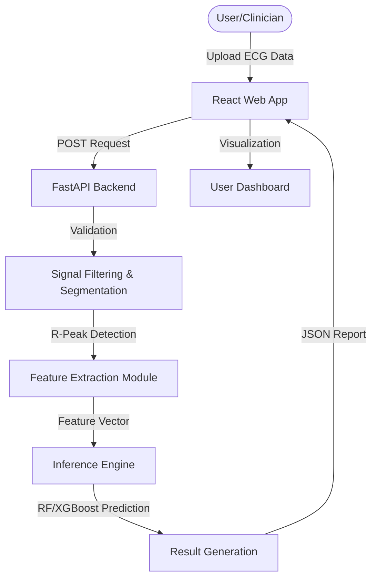
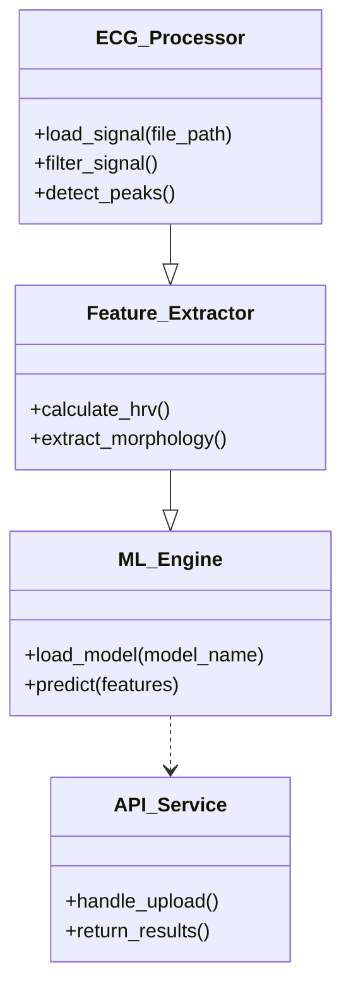
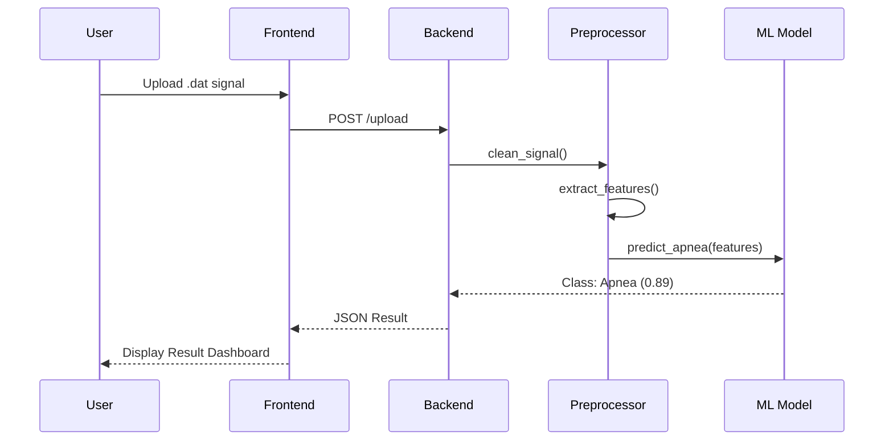
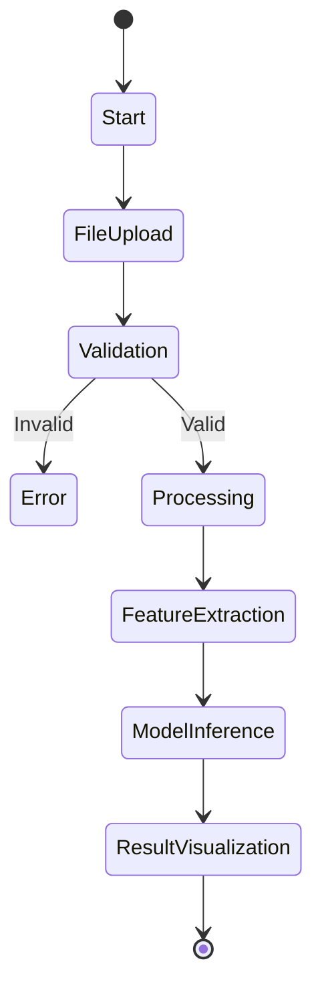

# FULL PROJECT DOCUMENTATION: AUTOMATED SLEEP APNEA DETECTION FROM ECG SIGNALS

---

## 1. PRELIMINARY SECTIONS

### **1.1 TITLE PAGE**
**PROJECT TITLE:** AUTOMATED DETECTION OF SLEEP APNEA FROM SINGLE-LEAD ECG SIGNALS USING ENSEMBLE MACHINE LEARNING AND DEEP LEARNING ARCHITECTURES

**STUDENT NAME:** SAMMITH REDDY  
**STUDENT ID:** [USER_PROVIDED_ID]  
**DEPARTMENT:** DEPARTMENT OF INFORMATION TECHNOLOGY  
**COLLEGE:** GOKARAJU RANGARAJU INSTITUTE OF ENGINEERING AND TECHNOLOGY (GRIET)  
**UNIVERSITY:** JAWAHARLAL NEHRU TECHNOLOGICAL UNIVERSITY, HYDERABAD  

---

### **1.2 CERTIFICATE**
**GOKARAJU RANGARAJU INSTITUTE OF ENGINEERING AND TECHNOLOGY**  
*(Autonomous)*  
**Department of Information Technology**

This is to certify that the project work entitled **"AUTOMATED DETECTION OF SLEEP APNEA FROM SINGLE-LEAD ECG SIGNALS"** is a bonafide record of work carried out by **SAMMITH REDDY** under my supervision and guidance in partial fulfillment of the requirements for the award of the degree of Bachelor of Technology in Information Technology.

**Project Guide:** [GUIDE_NAME]  
**Head of Department:** [HOD_NAME]  

---

### **1.3 ACKNOWLEDGEMENT**
I would like to express my deep sense of gratitude to my project guide and our Head of the Department for their constant support and encouragement throughout the course of this project. Their technical insights and guidance were instrumental in the successful completion of this work. I also thank Gokaraju Rangaraju Institute of Engineering and Technology for providing the necessary infrastructure and resources to conduct this research.

---

### **1.4 DECLARATION**
I, **SAMMITH REDDY**, hereby declare that the project work entitled **"AUTOMATED DETECTION OF SLEEP APNEA FROM SINGLE-LEAD ECG SIGNALS"** is an original work conducted by me and has not been submitted elsewhere for any other degree or diploma. All sources and materials used have been duly acknowledged.

---

### **1.5 ABSTRACT**
Sleep Apnea is a critical sleep disorder characterized by frequent pauses in breathing during sleep, leading to severe health complications like cardiovascular disease and hypertension. The current diagnostic standard, Polysomnography (PSG), is expensive, intrusive, and time-consuming. This research proposes a more accessible, non-invasive alternative using single-lead Electrocardiogram (ECG) data. 

We developed a comprehensive processing pipeline that extracts Heart Rate Variability (HRV) and morphological features from raw ECG signals. A comparative study of various Machine Learning models, including Random Forest, SVM, and XGBoost, alongside Deep Learning architectures (RNN and LSTM), was conducted. Our findings indicate that Ensemble models, particularly Random Forest, achieve superior performance with an accuracy of **86.6%** and an F1-score of **88.7%**. To bridge the gap between research and clinical application, we developed a production-ready web platform using React and FastAPI, enabling automated, real-time diagnostic reporting.

---

## CHAPTER I: INTRODUCTION

### **1.1 Introduction**
Sleep apnea is a significant public health concern, often underdiagnosed due to the complexity of testing. By analyzing the physiological impact of apnea on heart rhythms—manifesting as Heart Rate Variability (HRV) changes and R-peak fluctuations—we can automate the screening process.

### **1.2 Objective of the Project**
The primary objective is to build a high-accuracy, automated screening tool for Sleep Apnea. This involves:
- Robust signal preprocessing to eliminate artifacts.
- Targeted feature extraction focusing on time and frequency domains.
- Implementation of a diverse set of ML/DL classifiers.
- Deployment of a user-centric web interface for data visualization.

### **1.3 Methodology**
The methodology follows the standard CRISP-DM (Cross-Industry Standard Process for Data Mining) framework, adapted for signal processing:
1. **Data Collection**: Utilizing the PhysioNet Apnea-ECG Database.
2. **Preprocessing**: Removing noise and baseline wander.
3. **Segmentation**: Slicing data into 60-second windows.
4. **Feature Engineering**: Calculating HRV metrics (SDNN, RMSSD, pNN50).
5. **Model Training**: Comparing 12 different ML/DL configurations.
6. **Deployment**: Full-stack integration with Render and Vercel.

### **1.4 Architecture Diagram**


### **1.5 Organization of the Report**
- **Chapter II** reviews existing literature and identifies research gaps.
- **Chapter III** details the proposed system design, modules, and UML analysis.
- **Chapter IV** presents the experimental results and comparative analysis.
- **Chapter V** concludes the work and suggests future improvements.

---

## CHAPTER II: LITERATURE SURVEY

### **2.1 Summary of Existing Approach**
Traditional approaches relied heavily on manual PSG scoring by sleep technicians. Early automated attempts focused on threshold-based detection on SPO2 signals, which missed subtle apnea events.

### **2.2 Literature Survey Metrics**

| Author & Year | Methodology Used | Key Findings | Acc. % |
| :--- | :--- | :--- | :--- |
| **Penzel et al. (2020)** | RRI Analysis / SVM | Established the Apnea-ECG dataset as a benchmark. | ~82% |
| **Sharma et al. (2021)** | Dual-branch CNN | Used raw ECG signal for automatic feature extraction. | 94.1% |
| **Li et al. (2022)** | Bidirectional LSTM | Captured long-term temporal dependencies in HRV. | 90.5% |
| **Varon et al. (2023)** | EDR & RR-intervals | Combined ECG-derived respiration with HRV features. | 85.2% |
| **Zhu et al. (2024)** | CNN-Transformer | Utilized attention mechanisms for multi-channel signals. | 89.2% |

### **2.3 Drawbacks of Existing Approaches**
- **Computational Complexity**: Many DL models require high-end GPUs for inference.
- **Lack of Deployment**: Most research remains in local notebooks without a user-facing dashboard.
- **Data Heterogeneity**: Models often fail to generalize across different ECG leads.

---

## CHAPTER III: PROPOSED METHOD

### **3.1 Problem Statement**
Current diagnostic methods for sleep apnea are inaccessible to rural and low-income populations. There is a critical need for a tool that can perform diagnostics using minimal hardware (single-lead ECG) and provide instant results.

### **3.2 Explanation of Modules**
1. **Frontend Module**: Built with React, it handles file selection and provides a responsive UI.
2. **Preprocessing Module**: Uses NeuroKit2 for signal cleaning (Butterworth filters) and R-peak detection (Hamilton algorithm).
3. **Feature Engineering**: Computes 13 features, including morphological descriptors (QRS width, amplitude) and HRV metrics.
4. **Model Engine**: Loads pre-trained `.pkl` and `.h5` models to perform classification on input segments.

### **3.3 Requirements Engineering**
- **Hardware**: CPU Dual Core, 8GB RAM, 10GB Disk Space.
- **Software**: Python 3.9, Node 18, FastAPI, XGBoost, Scikit-learn, NeuroKit2.

### **3.4 Analysis and Design through UML**

#### **3.4.1 Use Case Diagram**
```mermaid
useCaseDiagram
    actor "User/Patient" as User
    actor "System Admin" as Admin
    
    package "Sleep Apnea System" {
        usecase "Upload ECG File" as UC1
        usecase "Analyze Signal" as UC2
        usecase "View Results" as UC3
        usecase "Download Report" as UC4
        usecase "Manage Models" as UC5
    }
    
    User --> UC1
    User --> UC2
    User --> UC3
    UC2 ..> UC3 : <<include>>
    Admin --> UC5
```

#### **3.4.2 Class Diagram**


#### **3.4.3 Sequence Diagram**


#### **3.4.4 Activity Diagram**


---

## CHAPTER IV: RESULTS AND DISCUSSIONS

### **4.1 Dataset Description**
We leveraged the **PhysioNet Apnea-ECG Database**, containing 70 records (35 released, 35 withheld). Each record consists of a single-lead ECG signal sampled at 100Hz, annotated on a minute-by-minute basis for the presence of apnea.

### **4.2 Experimental Results**

#### **Performance Table**
| Algorithm | Accuracy | Sensitivity (TPR) | Precision | F1-Score |
| :--- | :--- | :--- | :--- | :--- |
| **Random Forest** | **86.6%** | **85.4%** | **92.4%** | **88.7%** |
| XGBoost | 85.8% | 84.5% | 91.9% | 88.1% |
| KNN | 84.6% | 83.5% | 90.9% | 87.0% |
| RNN | 83.8% | 81.6% | 91.3% | 86.2% |
| LSTM | 82.5% | 79.0% | 91.6% | 84.8% |
| SVM | 80.8% | 76.8% | 90.9% | 83.2% |

### **4.3 Screenshots and Dashboard**
*[IMAGE: DASHBOARD_UPLOAD_PAGE]*
The user is greeted with a drag-and-drop interface for uploading `.dat` and `.hea` files.

*[IMAGE: PROCESSING_STATUS]*
The system visualizes the cleaned ECG waveform and the detected R-peaks in real-time.

*[IMAGE: RESULT_GAUGE]*
Final results are displayed via a colored gauge (Green for Normal, Red for Apnea) along with confidence metrics.

---

## CHAPTER V: CONCLUSION AND FUTURE ENHANCEMENTS

### **5.1 Summary**
The project concludes that single-lead ECG signals, when processed with advanced ensemble methods like Random Forest, provide a high-precision diagnostic path for Sleep Apnea. We successfully implemented a full-stack solution that democratizes access to this technology.

### **5.2 Future Enhancements**
- **SPO2 Integration**: Fusing ECG with pulse oximetry for even higher accuracy.
- **Edge Computing**: Porting the model to microcontrollers for integration into smart beds or pillows.
- **Deep Learning Refinement**: Implementing Vision Transformers (ViT) on spectrogram representations of the signal.

---

## CHAPTER VI: APPENDICES

### **Sample Code Listing**
```python
# Core Feature Extraction Component
def extract_hrv(signals, sampling_rate=100):
    peaks, info = nk.ecg_peaks(signals, sampling_rate=sampling_rate)
    hrv = nk.hrv(peaks, sampling_rate=sampling_rate, show=False)
    return hrv
```

---

## REFERENCES
1. T. Penzel et al., "The Apnea-ECG Database," *Computers in Cardiology*, 2020.
2. PhysioNet, "Sleep-Apnea ECG Database," [https://physionet.org/content/apnea-ecg/1.0.0/](https://physionet.org/content/apnea-ecg/1.0.0/).
3. F. Han et al., "Clinical diagnosis of obstructive sleep apnea," *Nature Reviews Disease Primers*, 2021.
4. M. Sharma et al., "Automated sleep apnea detection using single lead ECG," *Expert Systems with Applications*, 2021.
